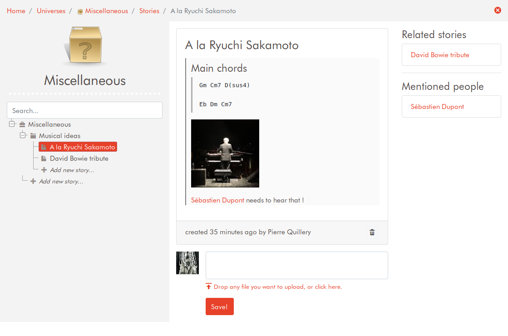
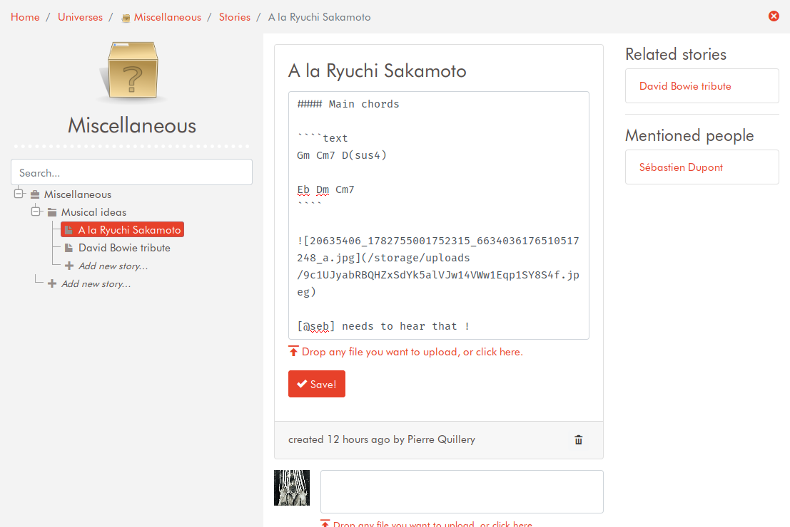
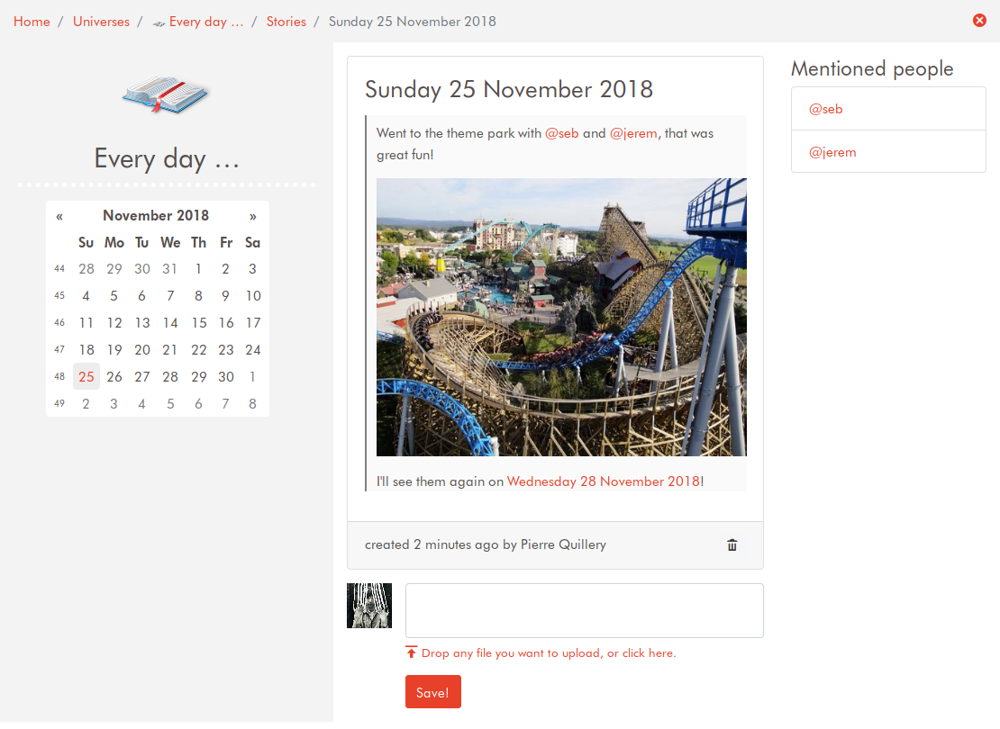

# Debrief

## What is it?

**Debrief is an easy to use note-taking application crossed with a diary.**

**A WORD OF CAUTION** : Debrief is still under heavy development at the moment and some core things may (and probably will) change. I still need to work toward a somewhat stable release.

### Features:

- **Open-source project** ;
- **Multi-users**, your notes can be **shared** with others ;
- Notes can be **commented on** ;
- **Markdown edition** is enabled everywhere ;
- **File uploads** are handled with simple drag'n'drop ;
- **Create links** between stories, diary pages, people … with autocompletion, date picker, etc. ;
- Available in French and English, languages can be easily added ;
- Multiple theme (light and dark) are available.

… And much more !

### Screenshots

#### Wiki story

You can arrange your notes in a hierarchical fashion, by simple moving nodes around in the tree on the left pane. 

Contextual information (related notes, people that are mentioned, …) is shown in the right pane.

 
 
 Simply double click on the text of the current story to edit it. In this example, you can see a picture was added by dragging a file onto the editor.
 
 
  
#### Diary Story

Stories can also be arranged in a more traditional "diary" fashion.
 
  
 
-----------------------

### I want to install it!

You're in luck, it's **easy as pie!**

See [the installation guide](install.md) for the details.

-----

### I want to help develop it!

That's a **very** good idea, don't hesitate to send me pull requests!

See [the development guide](develop.md) for more details.
